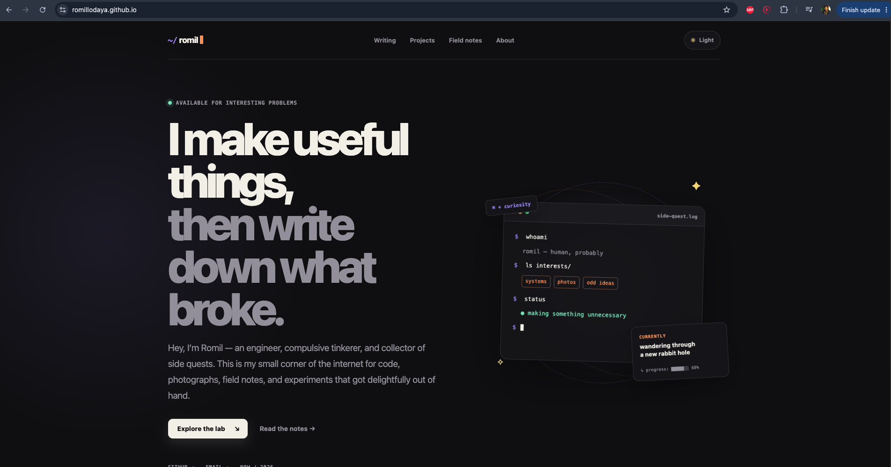

# Romil's personal site

A dark-first, GitHub Pages-ready personal portfolio for writing, experiments,
photographs, travel notes, and the occasional side quest.



## Make it yours

The reusable writing, project, and field-note content lives in `app/content.ts`.
The homepage lives in `app/page.tsx`, individual sections use their own route
folders, and the visual system lives in `app/globals.css`. Before publishing,
replace the starter email, GitHub link, project stories, current interests,
field notes, and portrait placeholder with your real details.

## Run locally

```bash
npm install
npm run dev
```

## Publish on GitHub Pages

1. Create a GitHub repository and push this project to its `main` branch.
2. In the repository, open **Settings → Pages**.
3. Set **Source** to **GitHub Actions**.
4. Push any change to `main`, or run the workflow manually from **Actions**.

The included workflow handles both `username.github.io` repositories and
project sites at `username.github.io/repository-name`.
